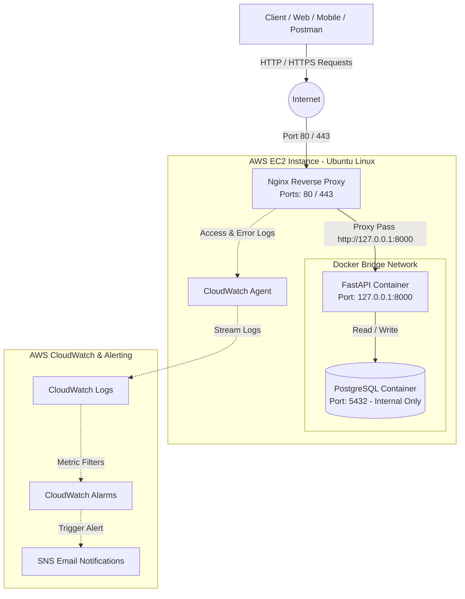
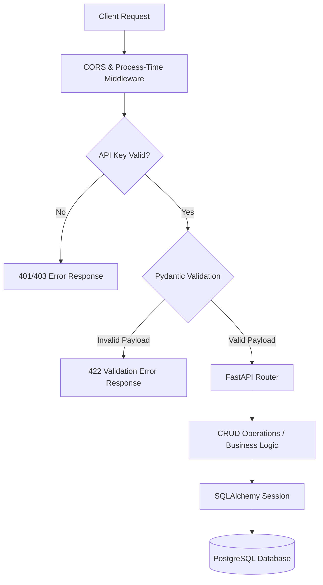
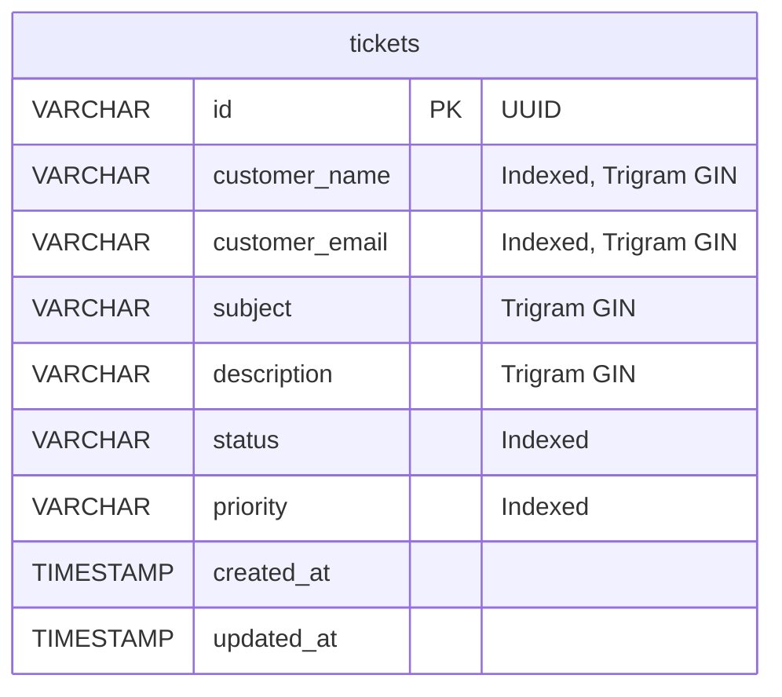
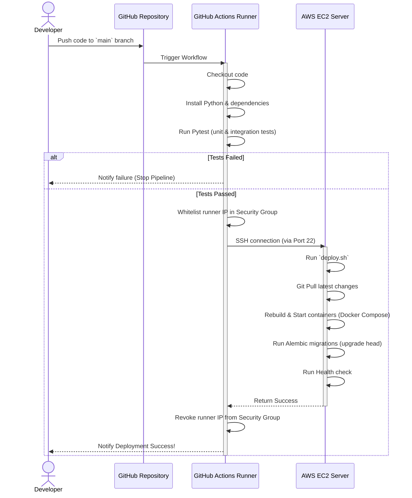

# System Architecture

This document describes the architectural layout, data flow, and CI/CD pipelines of the Support Ticket Management API.

## Architectural Layout

The service is deployed on a single AWS EC2 instance. Traffic flows through a reverse-proxy (Nginx) into a containerized FastAPI application which communicates with a PostgreSQL database.

### Components

1. **Client / Consumers**: Send HTTP requests with the required header `X-API-Key`.
2. **Nginx Reverse Proxy**:
   - Runs directly on the EC2 host (installed via `apt`, not containerized).
   - Listens on public port `80` (HTTP) and port `443` (HTTPS, if SSL is configured).
   - Handles SSL termination, routes traffic to `127.0.0.1:8000`, and logs request traffic to `/var/log/nginx/ticket_api_access.log`.
3. **FastAPI Application (Containerized)**:
   - Python 3.10+ async backend.
   - Listens on port `8000` inside the Docker network.
   - Bound only to loopback interface (`127.0.0.1:8000`) on the host system to prevent public security bypasses.
   - Manages business logic, authentication validation, request data checking, and ORM operations.
4. **PostgreSQL Database (Containerized)**:
   - Private persistent data store.
   - Accessible only to the FastAPI container through the secure Docker bridge network.
   - Database port `5432` is not published to the host, protecting it from external port-scans.
   - Persisted storage mounted to a named Docker volume (`postgres_data`).
5. **CloudWatch Agent**:
   - Installed on the EC2 host, tails Nginx access and error log files.
   - Streams log data to AWS CloudWatch Log Groups for persistent retention and querying.
6. **CloudWatch Alarms & SNS**:
   - Metric Filters detect patterns (e.g., HTTP 500 errors) in the streamed logs.
   - CloudWatch Alarms trigger SNS email notifications when thresholds are exceeded or when the EC2 instance status check fails.

---

## Software & Database Design

### Application Layer Flow

The diagram below details how requests are processed through the FastAPI application layer:

### Database Schema (ERD)

The database schema consists of a single optimized `tickets` table configured with indexes for search performance:

---

## CI/CD Pipeline Flow

This diagram describes the deployment workflow automated via GitHub Actions:

---

## Security Architecture & Best Practices

- **Port Isolation**: PostgreSQL is shielded inside the Docker network and cannot be scanned or accessed from the open internet.
- **Loopback Binding**: FastAPI only binds to `127.0.0.1` so requests must go through the Nginx proxy, ensuring all requests pass through logging and filtering rules.
- **Credential Protection**: Database passwords and API keys are not committed to Git. They are injected on the server via a `.env` file and passed into Docker Compose as runtime environment variables.
- **Minimal Exposure**: The AWS Security Group is configured to only allow inbound traffic on:
  - Port `80` (HTTP) & Port `443` (HTTPS) from anywhere (`0.0.0.0/0`).
  - Port `22` (SSH) restricted to the administrator's IP address.
